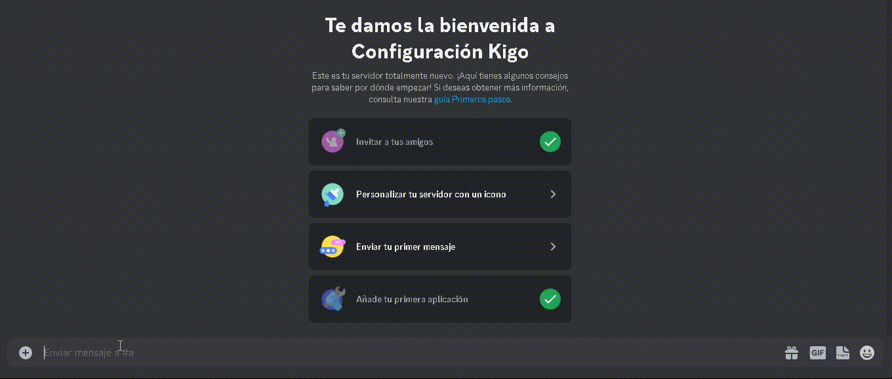

# Configuración del Bot

En esta sección se detallará la configuración de Kigo. A continuación, se muestra una lista de los sistemas de seguridad y utilidades disponibles, junto con enlaces directos a cada uno de ellos:

- [Crear Canales](#crear-canales)
- [Eliminar Canales](#eliminar-canales)
- [Actualizar Canales](#actualizar-canales)
- [Crear Roles](#crear-roles)
- [Eliminar Roles](#eliminar-roles)
- [Actualizar Roles](#actualizar-roles)
- [Prevenir Bots](#prevenir-bots)
- [Multicuentas](#multicuentas)
- [Prohibiciones Masivas](#prohibiciones-masivas)
- [Actualizar el Servidor](#actualizar-servidor)
- [Usuarios Maliciosos](#usuarios-maliciosos)
- [Prevenir Everyone/Here](#prevenir-everyonehere)
- [Enlaces de Discord](#enlaces-discord)
- [Enlaces de Páginas Web](#enlaces-paginas-web)
- [Menciones Fantasma](#menciones-fantasma)
- [Prevenir Spam](#prevenir-spam)

## 
###  Crear Canales
**Significado**: Previene que un usuario/bot pueda crear un canal.

**Sanción**: Si el usuario supera el limite se la prohibira.

**Configuración**: En este sistema se puede configurar el estado (activado o desactivado) y el limite.

## 
###  Eliminar Canales
- Estado: :onactiva: Activado
- Limite: 1

## 
###  Actualizar Canales
- Estado: :onactiva: Activado
- Limite: 2

## 
###  Crear Roles
- Estado: :onactiva: Activado
- Limite: 1

## 
###  Eliminar Roles
- Estado: :onactiva: Activado
- Limite: 1

## 
###  Actualizar Roles
- Estado: :onactiva: Activado
- Limite: 1

## 
###  Prevenir Bots
- Estado: :ofdesact: Desactivado
- Tipo: No Verificados

## 
###  Multicuentas
- Estado: :onactiva: Activado
- Días: 15

## 
###  Prohibiciones Masivas
- Estado: :onactiva: Activado
- Limite: 1

## 
###  Actualizar el Servidor
- Estado: :onactiva: Activado

## 
###  Usuarios Maliciosos
- Estado: :ofdesact: Desactivado

## 
###  Prevenir Everyone/Here
- Estado: :onactiva: Activado

## 
###  Enlaces de Discord
- Estado: :onactiva: Activado

## 
###  Enlaces de Páginas Web
- Estado: :onactiva: Activado

## 
###  Menciones Fantasma
- Estado: :onactiva: Activado

## 
###  Prevenir Spam
- Estado: :onactiva: Activado
- Limite: 6

---

📌 **Enlaces útiles:**
- 🗳️ Vota por Kigo en [Top.GG](https://top.gg/bot/917041621042888776)
- 🛠️ Únete a nuestro Servidor de Soporte en [Discord](https://discord.gg/vYThdaJMxh)
- 🔗 Invita a Kigo a tu servidor mediante este [enlace de invitación](https://top.gg/bot/917041621042888776/invite)
- 🎥 Síguenos en nuestro Canal de YouTube [YouTube](https://youtube.com/@KigoBot)
